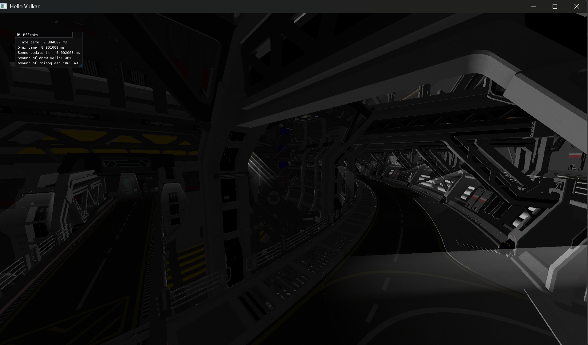
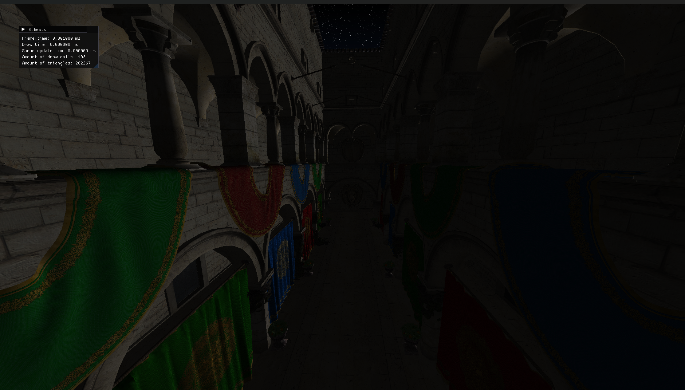

Vulkan Learning Project

That is my Vulkan API learning project, where I implement various Vulkan API + Computer graphic techniques.

Dependencies:
- SDL3
- Vulkan
- GLM
- fastgltf 
- Volk
- Imgui
- Vulkan Memory Allocator
- Vulkan-bootstrap
- Stb

Requirements:
- CMake 3.28 or higher
- Vcpkg
- A CMake compatible builder (Ninja or Visual Studio)
- python 3.x 
- Git
- Vulkan SDK

Building:
- git clone --recursive https://github.com/SolarianGG/VulkanMPR.git
- python ./vcpkg_init_project.py
- cmake --preset=default
- cmake --build build

Screenshots:

Implemented Features:
- Vulkan forward renderer
- GLTF model loading
- Bindless material model via descriptor buffers extension
- Slang shader language integration
- Batching and instancing

Future Features:
- Local illumination models (Blinn-Phong, Lambert, etc)
- Shadow mapping + Cascaded shadow maps
- Scene graph
- Skybox
- Environment mapping
- Deferred renderer 
- PBR (Cook-Torrance)
- Mesh shader based culling and rendering
- GPU driven rendering
- Multithreaded rendering (via TaskFlow for example)
- Frame graph
- Post-processing effects
- Particle system
- Global illumination
- Hybrid rasterization and ray tracing
