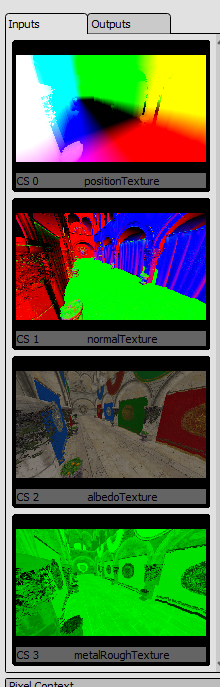
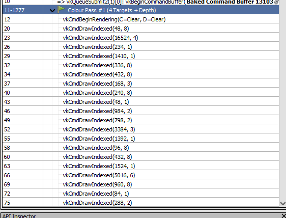
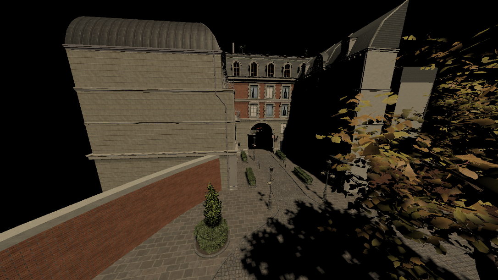
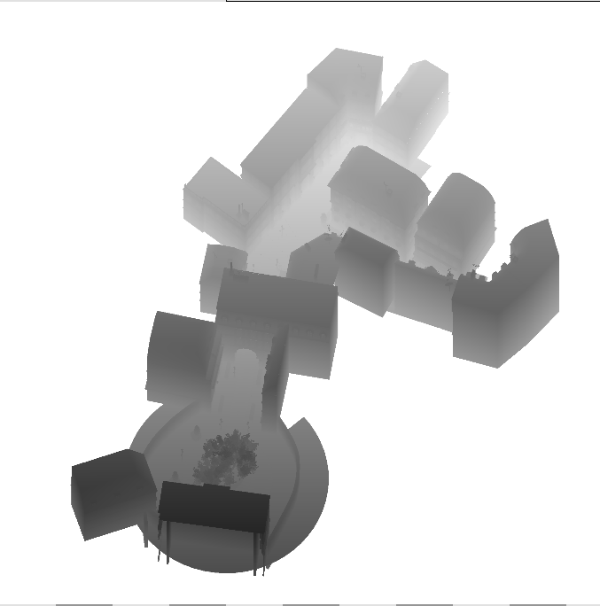
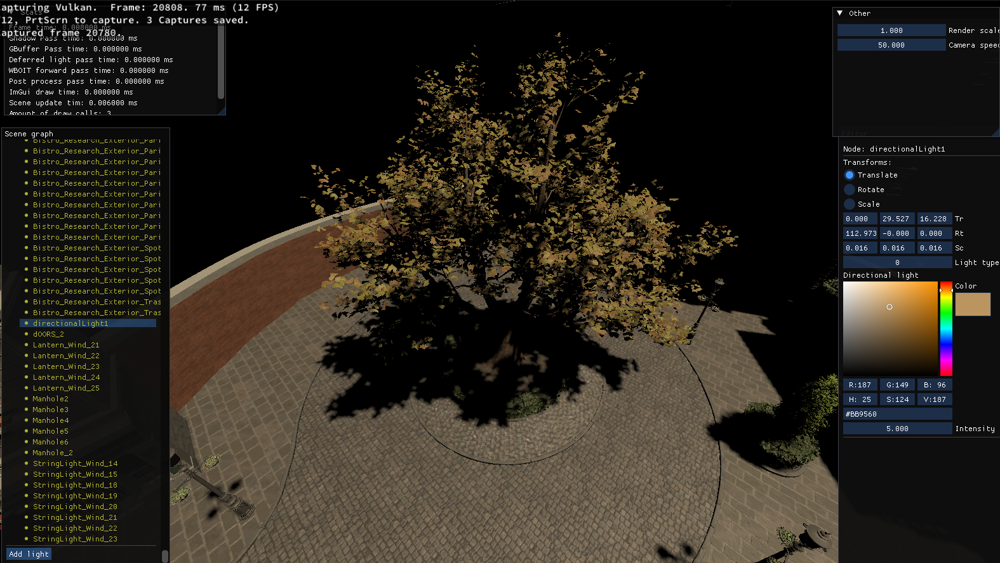

### Vulkan Learning Project

This is my personal Vulkan learning project, where I explore and implement various graphics techniques using the Vulkan API.

### Overview

The goal of this project is to build a modular and modern Vulkan-based rendering engine while deepening my understanding of real-time graphics systems.
It focuses on learning GPU resource management, descriptor systems, shader reflection, and advanced rendering techniques such as bindless materials and batching.

### Dependencies:
- SDL3
- Vulkan
- GLM
- fastgltf 
- Volk
- Imgui
- Imguizmo
- Vulkan Memory Allocator
- Vulkan-bootstrap
- Stb

### Requirements:
- CMake 3.28 or higher
- Vcpkg
- A CMake compatible builder (Ninja or Visual Studio)
- python 3.x 
- Git
- Vulkan SDK
- GPU that supports descriptor buffers, spirv 1.6 / shader model 6.5

### Building:
- git clone --recursive https://github.com/SolarianGG/VulkanMPR.git
- python ./vcpkg_init_project.py
- cmake --preset=default

#### Debug (default):
- python ./shader_cmp.py
- cmake --build build

#### Release:
- python ./shader_cmp.py --release
- cmake --build build --config Release

### Implemented Features:
- Vulkan deferred renderer

GBuffer pass structure is:

Depth buffer from depth prepass, used for reconstructing world position.
Normals (Texture format is RGBA32SF, will make RG16 in future)
Albedo color
Metal roughness color
Directional light cascade shadow map array.

- GLTF model loading
- Bindless material model via descriptor buffers extension
- Slang shader language integration
- Batching and instancing

- Scene graph (transforms, nodes, cameras, lights, materials)

- Normal mapping

Without normal mapping

With normal mapping

- Metal-roughness PBR material
- Weight blended order independent transparency

- Gamma correction on albedo textures + postprocess pass
- Indirect drawing with cull compute shader implemented using Wave Intrinsics
- Frustrum culling
- Directional shadow mapping

Directional shadow mapping for opaque surfaces implemented using 3x3 PCF with hardware SamplerComparisonState.
Directional light's view projection matrix is calculated using Scene AABB + frustum AABB clipping in light space which leads to better shadow map object depth's distribution.
Also applied constant bias to remove shadow acne.

This simple approach for sun's shadow will be removed in favor of CSM.

### Planned Features
- Tile-Based Omnidirectional Shadows [Hawar Doghramachi] [GPU Pro 6]
- Moment shadow mapping [Peters and Klein] [https://momentsingraphics.de/I3D2015.html]
- Screen space shadows [Graham Aldridge (Days Gone)] [https://www.bendstudio.com/blog/inside-bend-screen-space-shadows/]
- HDR + tonemap 
- PBR
- IBL
- Real-Time Lighting via Light Linked List [Abdul Bezrati] [GPU Pro 6]
- Volumetric Fog and Lighting [Bartlomiej Wro´nski] [GPU Pro 6]
- Render doc debug markers
- Multithreaded cmd record
- Bloom
- SSAO
- SSR
- Blur
- MSAA on deferred renderer / SMAA

