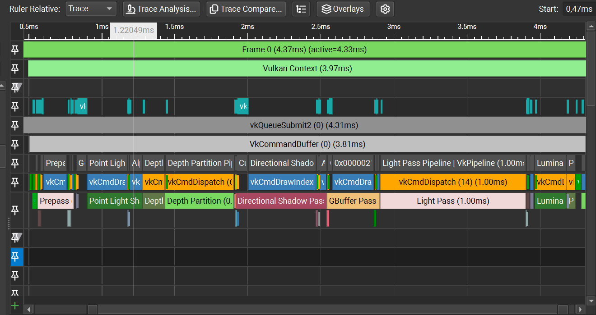
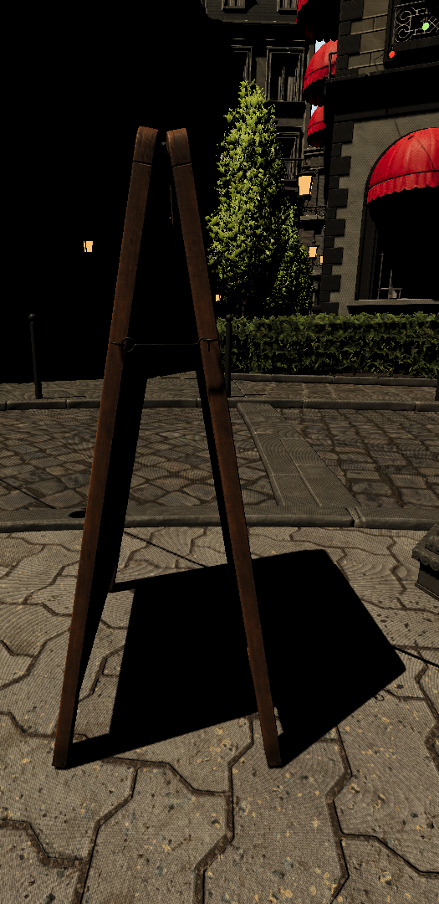
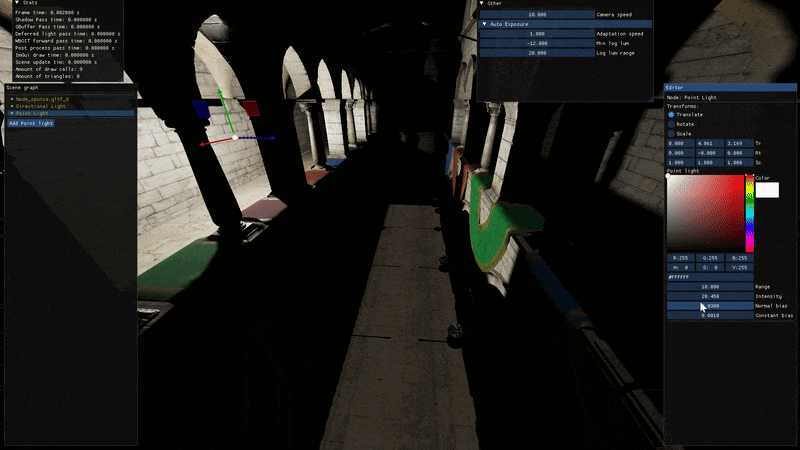
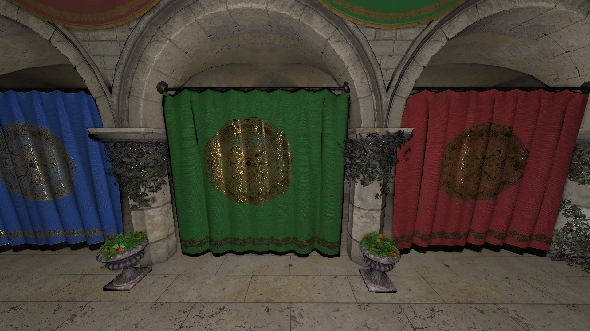
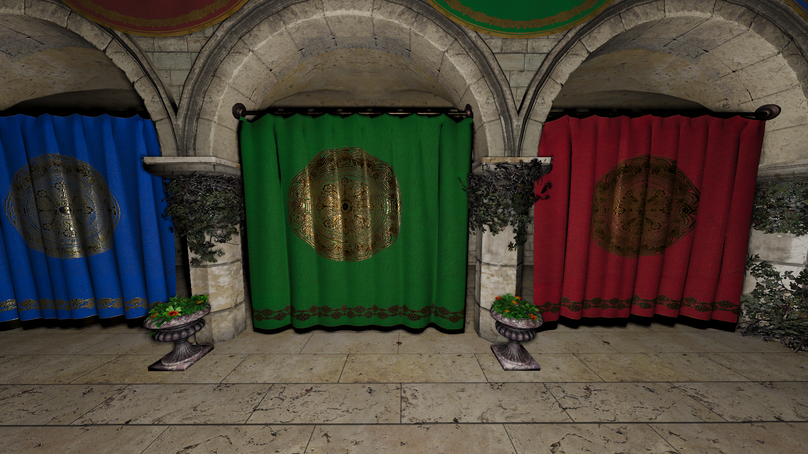

## VulkanMPR
A high-performance, modern graphics engine built in C++ and Vulkan, designed for real-time rendering and experimentation with advanced rendering techniques.

## Dependencies:
- SDL3
- Vulkan
- GLM
- fastgltf 
- Volk
- meshoptimizer
- Imgui
- Imguizmo
- Vulkan Memory Allocator
- Vulkan-bootstrap
- Stb

## Requirements:
- CMake 3.28 or higher
- Vcpkg
- A CMake compatible builder (Ninja or Visual Studio)
- python 3.x 
- Git
- Vulkan SDK
- GPU that supports descriptor buffers, spirv 1.6 / shader model 6.5

## Building:
- git clone --recursive https://github.com/SolarianGG/VulkanMPR.git
- python ./vcpkg_init_project.py
- cmake --preset=default

### Debug (default):
- python ./shader_cmp.py
- cmake --build build

### Release:
- python ./shader_cmp.py --release
- cmake --build build --config Release

## Core

- Fully **GPU-Driven** architecture.
- **Bindless rendering** for large numbers of textures and buffers via **descriptor buffers** extension.
- **Slang** shader language integration
- Optimal **glTF** model loading using **fastgltf** and **meshoptimizer**
- **Scene graph**
- **Metal-roughness** PBR materials
- **Debug labels** for more convenient RenderDoc + Nvidia nsights pipeline inspection

## Rendering features

- **Deferred shading**
- **SDSM** (Sample distribution shadow maps) **CSM** (Cascaded Shadow Maps) for directional light shadows.
- **Omnidirectional tiled tetrahedron shadow mapping** for point light shadows
- GPU Visible point lights culling
- GPU Meshes **frustum culling**
- **Gamma correction**
- **WBOIT** (Weight blended order independent transparency)
- **Normal mapping**
- **Vertex quantization**
- **Auto-exposure** using luminance histogram
- **ACES tone mapping**

## Demo

### Pipeline overview

<table>
  <tr>
    <td align="center"><em>Full render pipeline pass structure</em></td>
    <td align="center"><em>Per-pass GPU frame time breakdown</em></td>
  </tr>
  <tr>
    <td></td>
    <td></td>
  </tr>
</table>

### Sponza

<table>
  <tr>
    <td></td>
    <td></td>
  </tr>
  <tr>
    <td></td>
    <td></td>
  </tr>
</table>

<table>
  <tr>
    <td align="center"><em>Scene + Imgui</em></td>
  </tr>
  <tr>
    <td></td>
  </tr>
</table>

### Shadows

#### SDSM CSM

Each row shows the cascade split visualization (left) alongside the final rendered result (right).

<table>
  <tr>
    <td align="center"><em>1 cascade - split regions</em></td>
    <td align="center"><em>1 cascade - final render</em></td>
  </tr>
  <tr>
    <td></td>
    <td></td>
  </tr>
  <tr>
    <td align="center"><em>2 cascades - split regions</em></td>
    <td align="center"><em>2 cascades - final render</em></td>
  </tr>
  <tr>
    <td></td>
    <td></td>
  </tr>
  <tr>
    <td align="center"><em>3 cascades - split regions</em></td>
    <td align="center"><em>3 cascades - final render</em></td>
  </tr>
  <tr>
    <td></td>
    <td></td>
  </tr>
  <tr>
    <td align="center"><em>4 cascades - split regions</em></td>
    <td align="center"><em>4 cascades - final render</em></td>
  </tr>
  <tr>
    <td></td>
    <td></td>
  </tr>
</table>

#### Difference between SDSM CSM and Simple Directional shadow mapping

<table>
  <tr>
    <td align="center"><em>Simple DSM - shadow map coverage</em></td>
    <td align="center"><em>SDSM CSM - shadow map coverage (tighter fit)</em></td>
  </tr>
  <tr>
    <td></td>
    <td></td>
  </tr>
  <tr>
    <td align="center"><em>Simple DSM - Single shadow map projection tightened to scene bounds</em></td>
    <td align="center"><em>SDSM CSM - Each cascade shadow map tightens only part of depth buffer</em></td>
  </tr>
  <tr>
    <td></td>
    <td></td>
  </tr>
</table>

#### Omnidirectional tiled tetrahedron shadow mapping

<table>
  <tr>
    <td align="center"><em>Tetrahedron shadow map - all faces packed in a single texture</em></td>
    <td align="center"><em>Point light shadows applied in scene</em></td>
  </tr>
  <tr>
    <td></td>
    <td></td>
  </tr>
</table>

#### Avoiding Shadow acne and Peter panning by using normal offset bias + constant bias

<table>
  <tr>
    <td align="center"><em>No bias or too low constant bias - shadow acne</em></td>
    <td align="center"><em>Only constant bias - Peter panning</em></td>
    <td align="center"><em>With normal offset + lower constant bias - clean contact shadows</em></td>
  </tr>
  <tr>
    <td></td>
    <td></td>
    <td></td>
  </tr>
</table>

### Auto-exposure using luminance histogram

The camera exposure adapts dynamically as the scene brightness changes, computed via a luminance histogram on the GPU.

<table>
  <tr>
    <td align="center"><em>Auto-exposure in action - adapts from bright to dark areas</em></td>
  </tr>
  <tr>
    <td></td>
  </tr>
</table>

### ACES Tone mapping

<table>
  <tr>
    <td align="center"><em>Without tone mapping</em></td>
    <td align="center"><em>With ACES tone mapping + auto exposure</em></td>
  </tr>
  <tr>
    <td></td>
    <td></td>
  </tr>
</table>

### Gamma correction

<table>
  <tr>
    <td align="center"><em>Without gamma correction — colors appear dark and washed out</em></td>
    <td align="center"><em>With gamma correction — perceptually correct brightness</em></td>
  </tr>
  <tr>
    <td></td>
    <td></td>
  </tr>
</table>

### Normal mapping

<table>
  <tr>
    <td align="center"><em>Without normal maps - flat, geometry-only shading</em></td>
    <td align="center"><em>With normal maps - surface detail and micro-lighting</em></td>
  </tr>
  <tr>
    <td></td>
    <td></td>
  </tr>
</table>

### WBOIT

<table>
  <tr>
    <td align="center"><em>Weight Blended Order Independent Transparency - correct blending without depth sorting</em></td>
  </tr>
  <tr>
    <td></td>
  </tr>
</table>

### Scene manipulation

<table>
  <tr>
    <td align="center"><em>Translation</em></td>
    <td align="center"><em>Rotation</em></td>
    <td align="center"><em>Scale</em></td>
  </tr>
  <tr>
    <td></td>
    <td></td>
    <td></td>
  </tr>
</table>

## Reference papers

[SDSM](https://www.researchgate.net/publication/220791941_Sample_distribution_Shadow_Maps)

Omdirectional tiled tetrahedron shadow mapping (GPU Pro 6)

[Vertex data quantization](https://daniilvinn.github.io/2024/05/04/omniforce-vertex-quantization.html)

[Auto-exposure](https://bruop.github.io/exposure/)

## Planned rendering feautres

- Switch from Lambert to Burley diffuse BRDF
- IBL
- FXAA 3.11 / SMAA
- SSAO
- SSR
- Bend studio contact shadows
- Occlusion culling
- Bloom
- Depth of field
- Motion blur
- Lens flare
- Chromatic abberation
- SSGI
- Clustered deferred
- Descriptor heaps
- Frame graph
- BC texture compression
- Async compute

